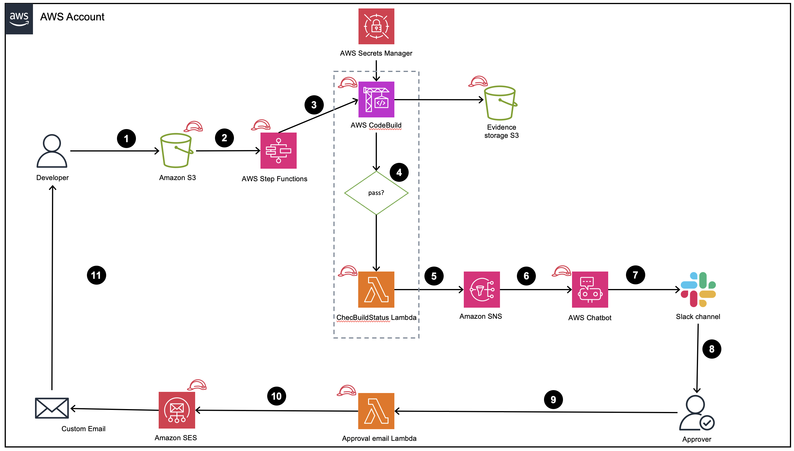

## chatops-slack

## Summary
In today's fast-paced software development environment, managing Static Application Security Testing (SAST) scan results efficiently is crucial for maintaining code quality and security. However, many organizations face significant challenges:
    - Delayed awareness of critical vulnerabilities due to inefficient notification systems.
    - Slow decision-making processes caused by disconnected approval workflows.
    - Lack of immediate, actionable responses to SAST scan failures.
    - Fragmented communication and collaboration around security findings.
    - Time-consuming and error-prone manual infrastructure setup for security tooling.

These issues often lead to increased security risks, delayed releases, and reduced team productivity. There is a pressing need for a solution that can streamline SAST result management, enhance team collaboration, and automate infrastructure provisioning to address these challenges effectively.

To address these critical challenges, we present a comprehensive solution that leverages the power of AWS Chatbot to streamline the management of Static Application Security Testing (SAST) scan failures reported via SonarQube. This innovative approach integrates custom actions and notifications into a conversational interface, enabling efficient collaboration and decision-making processes within development teams.

Key features of the solution include:

    1. Customized Notifications: Real-time alerts and notifications are delivered directly to team chat channels, ensuring prompt awareness and action on SAST scan vulnerabilities or failures.
    2. Conversational Approvals: Stakeholders can initiate and complete approval workflows for SAST scan results seamlessly within the chat interface, accelerating decision-making processes.
    3. Custom Actions: The solution allows teams to define and execute custom actions based on SAST scan outcomes, such as automatically triggering emails for quality gate failures, enhancing responsiveness to security issues.
    4. Centralized Collaboration: All SAST scan-related discussions, decisions, and actions are kept within a unified chat environment, fostering improved collaboration and knowledge-sharing among team members.
    5. Infrastructure as Code (IaC): The entire solution is wrapped with AWS CloudFormation templates, enabling faster and more reliable infrastructure provisioning while reducing manual setup errors.

## Architecture

## Automated Code Quality Assurance Workflow

1. Code Preparation and Upload: 
    - Developer compresses the codebase into a ZIP file.
    - Developer manually uploads zip file to a designated Amazon S3 bucket.
2. Amazon S3 Event Trigger and AWS Step Functions Orchestration:
    - Amazon S3 upload event triggers an AWS Step Functions workflow.
    - Step Functions orchestrates a SAST (Static Application Security Testing) scan using SonarQube.
    - Workflow monitors AWS CodeBuild job status to determine next actions: 
        * If AWS CodeBuild succeeds (Quality Gate pass), the workflow terminates. 
        * If  AWS CodeBuild fails, a Lambda function is invoked for diagnostics.
3. AWS CodeBuild Execution:
    - Aws CodeBuild job executes SonarQube scan on the uploaded codebase.
    - Scan artifacts are stored in a separate Amazon S3 bucket for auditing and analysis.

4. Failure Analysis (AWS Lambda Function):
    - On AWS CodeBuild failure, the CheckBuildStatus AWS Lambda function is triggered.
    - On AWS CodeBuild success, the process is terminated and no further action is needed.

5. Function analyzes failure cause (Quality Gate failure or other issues)  
    - CheckBuildStatus AWS Lambda creates a custom payload with detailed failure information.
    - CheckBuildStatus AWS Lambda publishes the custom payload to an Amazon SNS topic.

6. Notification System:
    - Amazon SNS forwards the payload to AWS Chatbot for Slack integration.

7. Slack Integration:
    - AWS Chatbot posts a notification in the designated Slack channel.

8. Approval Process:
    - Approvers review the failure details in the Slack notification.
    - Approvers can initiate approval using the "Approve" button in Slack.

9. Approval Handler:
    - An Approval AWS Lambda function processes the approval action from Slack.
    - Function generates a custom message for developer notification.
    - Approval AWS Lambda function publishes the custom message to Amazon SES.

10. Developer Notification: 
    - Amazon SES sends an email to the developers with next steps or required actions.

This workflow combines manual code upload with automated quality checks, provides immediate feedback through Slack,

## Pre-requisites
AWS Chatbot to be added to slack the required slack workspace as a plugin. Refer [Add apps to slack workspace](https://slack.com/intl/en-in/help/articles/202035138-Add-apps-to-your-Slack-workspace) for further details. Keep a note of the slack Workspace ID shown on the AWS Console after successful registration.

An IAM role with permissions to create and manage the following AWS resources: AWS S3 buckets, AWS Step Functions, AWS CodeBuild, AWS Secrets Manager, AWS Lambda functions, Amazon SNS, Amazon SES, and AWS Chatbot.

This solution uses a source email that is created and verified in Amazon SES to send out approval emails. Refer to [Creating and verifying email identities](https://docs.aws.amazon.com/ses/latest/dg/creating-identities.html#verify-email-addresses-procedure) for setup instructions.

A destination email address for receiving approval notifications. This can generally be a shared inbox or a particular team distribution list. 

An operational SonarQube instance accessible from your AWS account. For SonarQube installation instructions, refer to the official documentation [here](https://docs.sonarsource.com/sonarqube/latest/setup-and-upgrade/install-the-server/introduction/).

A SonarQube [user token](https://docs.sonarsource.com/sonarqube/latest/user-guide/user-account/generating-and-using-tokens/) with permissions to trigger and create projects via the pipeline.

A configured AWS Chatbot client, with the workspace ID readily available for input in the CloudFormation console. Refer [configure a slack client](https://docs.aws.amazon.com/chatbot/latest/adminguide/slack-setup.html#slack-client-setup) for instructions.

## Security

See [CONTRIBUTING](CONTRIBUTING.md#security-issue-notifications) for more information.

## License

This library is licensed under the MIT-0 License. See the LICENSE file.

## Limitations
Custom actions for AWS Chatbot are currently not supported through AWS CloudFormation. The creation of custom action buttons is a manual process in this version of the solution. Automation of custom action deployment via AWS CloudFormation is planned for future releases, enhancing the overall Infrastructure as Code capabilities of this solution.

